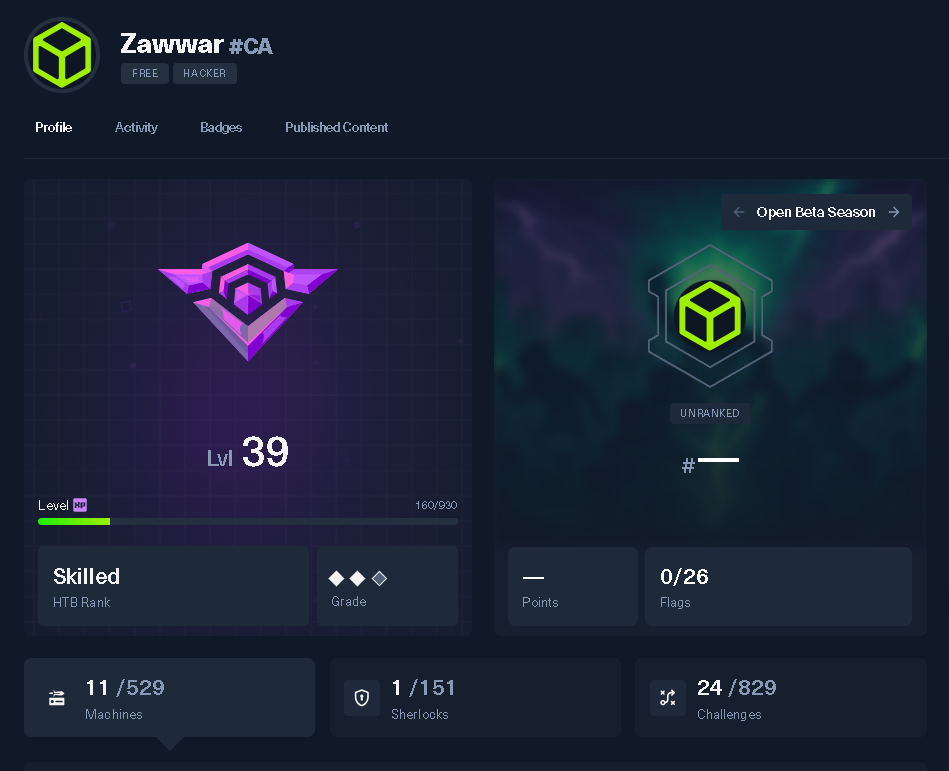

  

# Hack The Box — Progress

  

This is the public side of my Hack The Box notebook. Writeups land here when a box retires or when a challenge is from a public CTF event. Active machines stay private until they retire. The point is not the points. The point is the patterns, which is why this repo has a `patterns/` folder that grows faster than the `challenges/` one.

I am **Zawwar Sami**, an independent engineer and researcher based in Canada. I write about engineering and AI at [zawwarsami.com](https://zawwarsami.com). The HTB profile lives at [app.hackthebox.com/public/users/2469522](https://app.hackthebox.com/public/users/2469522).

## What is in here

| Folder | What it contains |
|---|---|
| [`challenges/`](challenges/) | Writeups for HTB CTF challenges from public events (mostly the 2026 MCP TryOut). One file per challenge, grouped by category. |
| [`machines/`](machines/) | Writeups for HTB machines, restricted to retired or Starting Point boxes. Each box has its own folder. |
| [`patterns/`](patterns/) | Cross-machine lessons. Short notes on a single trick that worked in one place and is going to work in another. |
| [`methodology/`](methodology/) | My approach per challenge category, in plain prose. What I check first, what I keep in the cheat-sheet, how I avoid burning the 30-minute timer. |

## Index of writeups

### Challenges — MCP TryOut 2026

| Challenge | Category | Points | Difficulty |
|---|---|---|---|
| [Flag Command](challenges/web/flag-command.md) | web | 300 | very easy |
| [Hidden Path](challenges/web/hidden-path.md) | web | 1000 | very easy |
| [Labyrinth Linguist](challenges/web/labyrinth-linguist.md) | web | 1000 | very easy |
| [OmniWatch](challenges/web/omniwatch.md) | web | 1000 | very easy |
| [TimeKORP](challenges/web/timekorp.md) | web | 1000 | very easy |
| [Jailbreak](challenges/web/jailbreak.md) | web | 1000 | very easy |
| [Chrono Mind](challenges/misc/chrono-mind.md) | misc | 1000 | very easy |
| [Hidden Path (misc cousin)](challenges/misc/hidden-path-express.md) | misc | 1000 | very easy |
| [Prison Pipeline](challenges/misc/prison-pipeline.md) | misc | 1000 | very easy |
| [Locked Away](challenges/misc/locked-away.md) | misc | 1000 | very easy |
| [Stop Drop and Roll](challenges/misc/stop-drop-and-roll.md) | misc | 825 | very easy |
| [Character](challenges/misc/character.md) | misc | 825 | very easy |
| [Getting Started](challenges/pwn/getting-started.md) | pwn | 300 | very easy |
| [Regularity](challenges/pwn/regularity.md) | pwn | 300 | very easy |
| [Don't Panic](challenges/rev/dont-panic.md) | rev | 875 | very easy |
| [LootStash](challenges/rev/lootstash.md) | rev | 300 | very easy |
| [Satellite Hijack](challenges/rev/satellite-hijack.md) | rev | 900 | very easy |
| [Tunnel Madness](challenges/rev/tunnel-madness.md) | rev | 1000 | very easy |
| [FlagCasino](challenges/rev/flag-casino.md) | rev | 800 | very easy |
| [Dynastic](challenges/crypto/dynastic.md) | crypto | 725 | very easy |
| [Phreaky](challenges/forensics/phreaky.md) | forensics | 900 | very easy |
| [Silicon Data Sleuthing](challenges/forensics/silicon-data-sleuthing.md) | forensics | 1000 | very easy |
| [An Unusual Sighting](challenges/forensics/unusual-sighting.md) | forensics | 825 | very easy |
| [Critical Flight](challenges/hardware/critical-flight.md) | hardware | 1000 | very easy |
| [Shush Protocol](challenges/hardware/shush-protocol.md) | ics | 800 | very easy |

### Machines — Starting Point

| Machine | Tier | OS | Difficulty |
|---|---|---|---|
| [Meow](machines/starting-point/meow.md) | 0 | Linux | very easy |
| [Fawn](machines/starting-point/fawn.md) | 0 | Linux | very easy |

More machine writeups will land here as boxes retire. The active ones stay in my private notes.

## How to read a writeup

Every file uses the same five sections. I started with the standard "recon → foothold → privesc" format and dropped it because nobody learns from someone else's recon. They learn from someone else's mistakes. So the template is:

1. **TL;DR** — one paragraph, what cracked it.
2. **What I saw first** — the entry point, the thing that stood out.
3. **What I tried that did not work** — the dead ends, in order.
4. **What worked** — the exploit, in plain English.
5. **What this taught me** — the pattern, transferable.

The dead-ends section is the one that earns the existence of this repo. The internet has enough writeups that march straight from recon to flag without admitting any of the wrong turns. Those writeups taught me less than my own mistakes did, so I am writing the kind of writeup I wish I had been reading.

## A note on safety

HTB has clear rules about what you can publish about active machines. This repo respects them. If a box you want to read about is missing, it is either active, or I have not solved it yet, or both. The first will fix itself when HTB retires the box. The second is on me.

## License

Code snippets in this repo (exploit scripts, helper one-liners) are MIT. Writeups themselves are CC BY 4.0. Use whatever you find, credit where appropriate.

---

*Maintained by [Zawwar Sami](https://zawwarsami.com). Last update: 2026-04. Issues and corrections welcome.*
